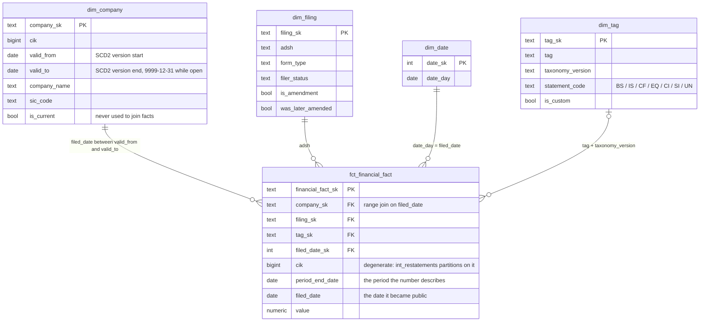

# SEC Restatement Analysis

Companies revise the numbers they publish. A figure reported in one filing can
appear at a different value in a later one, for the same period and the same
unit, months afterwards.

This is a warehouse over the SEC's bulk XBRL data built to find those cases. It
keeps two dates on every fact: the period the number describes, and the date it
became public. Almost everything here follows from not collapsing them.

Postgres and dbt over **42,797,341 numeric facts from 81,720 filings**, 2023 Q1
to 2025 Q4. **426,706 restatements detected.**

## Headline findings

**Comparing companies on restated figures moves one in thirty-three into a
different quartile.** The same peer comparison was built twice over the identical
3,441 companies and the identical fiscal year. Once from what was knowable on
2024-06-30, once from everything filed since. Same metric, same peers, same
period, same code. 103 companies land in a different performance quartile, 42 of
them moving two or more. Nothing on the output marks which rows moved.

The largest cause is not restatement. It is industry reclassification: 19
companies changed SIC major group and 18 of them moved quartile materially, nine
being software and electronics firms that became financial firms after the
period.

**Restatements do not arrive in amendments.** Only 8.26% of the 426,706 revisions
came in a form ending in `/A`. The rest arrived inside an ordinary 10-Q or 10-K
carrying a revised comparative, median 364 days later, unmarked. Watching for
amendments catches one restatement in twelve.

**Revision predicts revision.** Revised once, 7.78% chance of being revised
again. Twice, 17.82%. Three times, 22.94%. The count of prior revisions ships in
`int_restatements` and needs no model.

**One restatement in nine is not a revision of a value.** Three categories,
defined in advance and counted across the whole population: 6,950 zero-origin
facts, 10,061 revisions above 10,000%, 29,118 exact sign flips. Disjoint,
totalling 10.81%. Adding the classes found by sampling takes identifiable
artefacts to roughly 16%, and the rate from 4.785% to about 4.01%.

The downward skew survives that. 57.76% of revisions are reductions; excluding
all three artefact classes gives 60.02%, because those classes were diluting it.

**Restating is normal, which inverts the data quality result.** 86.8% of
companies restate something. 96% of large accelerated filers do, against 88% of
non-accelerated, and large filers restate 40% more facts each. Data quality runs
the other way: the smallest filers fail 0.54 rules on average against 0.07 for
the largest. A screen built on filer size catches one problem and misses the
other.

## How detection works

A restatement is one described fact reported at two different values by two
filings published on different dates. The partition key:

```
(cik, coregistrant, segments, tag, period_end_date, qtrs, unit_of_measure)
```

ordered by `filed_date`. `adsh` is absent on purpose. Comparing across filings is
the mechanism.

Three of those columns are false-positive guards rather than identity, and they
carry the result. Holding the method fixed, the restated share is 7.02% on
`(cik, tag, period_end_date, qtrs, unit_of_measure)` alone and 4.785% on the full
key. `segments` does almost all of that, by stopping segment-level figures being
compared against consolidated totals.

| Measure | Value |
|---|---|
| Facts reported on more than one date | 8,918,472 |
| Restatements detected | 426,706 |
| Restatement rate | 4.785% |
| Companies restating | 7,544 of 8,693 |
| Arriving via an amendment | 8.26% |
| Median days to first revision | 364 |
| Reductions | 57.76% |
| Reductions, artefact classes excluded | 60.02% |
| Identifiable as artefact | ~16% |

A change below 0.1% of the original value is treated as a change in reported
precision, not a restatement. That threshold is a judgement call rather than
something the distribution suggested, and
[`docs/findings.md`](docs/findings.md) §2.8 gives the sensitivity: moving it
across two orders of magnitude moves the rate from 5.12% to 3.59%.

## Filing behaviour

**The original-to-amendment gap is 98 days**, not the 140 that subtracting one
median from another suggested. Pairing each amendment to the specific original it
amends removes pre-2023 originals from both sides at once. The gradient inverts
the data quality one: large accelerated filers publish fastest and amend slowest,
159 days against 92.

**Promptness has not drifted over twelve quarters.** No form-and-status series
clears r² = 0.5. Seasonality swings 27 days inside one year against a fitted
slope of zero. Reported as a negative result: the series is too short to rule out
a drift of under a day per year.

**2,862 companies file to the deadline habitually.** Established by runs of three
or more consecutive filings, found with gap-and-island rather than a count, which
is what separates them from the 1,141 intermittent companies that file at the
deadline nearly as often but never in a run.

| Measure | Value |
|---|---|
| Companies compared, point-in-time vs latest | 3,441 |
| Changed quartile materially | **103** (96 after artefacts) |
| Caused by own restated values | 88 |
| Caused by SIC reclassification | 19 |
| Caused only by peers moving | 150 (4 material) |
| Filings made at their statutory deadline | 25,782 of 69,907 |
| Filings late | 6.46% to 11.97% |

The late rate is a range because the data cannot narrow it. 8,371 filings miss
the statutory date, but 3,856 land inside the Rule 12b-25 extension window and
were probably deemed timely. Form 12b-25 carries no XBRL, so whether the
extension was invoked is unobservable here.

## What point-in-time discipline is worth

Stage 4 prices the same idea against a prediction. Two feature tables over 58,726
filings, same label, same five features, same trivial logistic regression. The
only difference is whether the company's prior-restatement count and its sector
base rate were computed as of `filed_date` or over the whole loaded range.

Training splits on filing date, never at random. These are panel data, and a
random split lets the model recognise the company rather than predict anything.

| Feature set | Test AUC |
|---|---|
| Point-in-time | 0.5894 to 0.6102 |
| Naive | 0.7172 to 0.7218 |
| **Gap** | **0.1116 to 0.1278** |

Between 0.11 and 0.13 of test AUC is information from after the filing date. That
is the distance between a weak honest model and one that reads as a usable
screen, and nothing on the naive table marks it. Same rows, same label, same five
column names.

Almost all of it is one feature. `prior_restatement_count` over the full window
scores 0.7180 alone, higher than the entire fitted naive model, because the
restatement that sets the label is one of the events it counts. Point-in-time it
scores 0.5669.

The model is deliberately trivial and is not the deliverable. Default logistic
regression, no tuning, no class weighting. A better model would raise both
numbers.

Rebuilt at 90, 120, 180, 240 and 270 day horizons, the gap sits between 0.115 and
0.130 across the first four. The 270-day point is larger and discounted: its test
set is a single annual-report quarter.

## Query performance

Three optimisations measured before and after against the 42.8M-row fact table.
Full plans and block counts in [`docs/performance.md`](docs/performance.md).

| # | Query | Before | After | Change | Result |
|---|---|---|---|---|---|
| 1 | Restatement self-join, 20 filers | 57.0 s | 2.31 s | B-tree `(cik, tag, period_end_date)` | 25× |
| 2 | One month of facts by `filed_date` | 8.0 s | 6.4 s | BRIN, 376 kB | no change, identical plan |
| 2b | *same query* | 8.0 s | 1.01 s | B-tree, 283 MB | 8×, at 771× the index size |
| 3 | First/latest value per fact | 30.0 s | 10.6 s | correlated subquery to window function | 2.8× |
| 3b | *same, 3.6× the rows* | 192.2 s | 10.3 s | *same* | 18.6× |

Case 2 is a negative result and documented at length for that reason. BRIN was
the wrong instrument for a column with a correlation of 0.029, and 2b is the
control showing the query was improvable anyway. The measurement environment
degraded about 45% mid-session and invalidated a first round of numbers; every
figure above comes from one clean pass afterwards.

Every index created for these measurements was dropped. The table ships with one,
on `financial_fact_sk`.

## Data quality

Eight rules over the same data, each documented in
[`docs/findings.md`](docs/findings.md) §1 with an executable predicate, a root
cause where one is established, and a recommended action.

| Rule | Dimension | Severity | Rows | % |
|---|---|---|---|---|
| Null numeric value | completeness | High | 1,898,905 | 4.437 |
| Reporting duration exceeds ten years | validity | High | 951 | 0.0022 |
| Duplicate key with conflicting values | consistency | High | 300 | 0.0007 |
| Rejected at load: embedded delimiter | validity | Medium | 236 | 0.0006 |
| Filing lag exceeds three years | timeliness | Medium | 59 | 0.0722 |
| Balance sheet identity violation | accuracy | High | 12 | 0.0077 |
| Filed before the period it reports | validity | High | 4 | 0.0049 |

Two results from that stage are worth pulling out.

**The SEC's documented natural key is incomplete.** It publishes the primary key
of the numeric fact file without `segments`. Testing uniqueness on that basis
gave 4,635,667 violations. Adding `segments` left 154, all carrying conflicting
values inside one filing, with gaps up to 9,000% and frequently opposite signs.

**One rule over-flags, and the report says so.** Verification of the duration
rule found 77% of flagged rows in a band consistent with legitimate
inception-to-date reporting by development-stage companies. Only 15 facts across
2 filings are unambiguously defective. The rule is retained with that caveat
rather than quietly retuned.

## Running it

```bash
cp .env.example .env          # set SEC_USER_AGENT to a real contact string
make up                       # Postgres 16 in Docker
make fetch                    # downloads quarterly bulk files from sec.gov
make load                     # tab-delimited COPY into a raw schema
cd dbt && dbt deps && dbt build
```

Requires Python 3.12 and Docker. dbt-core does not yet run on 3.13.

`int_restatements` is deterministic: two consecutive builds return 426,706 rows
with identical checksums. An earlier version tiebroke conflicting same-day values
on accession number alone, which is not a total order when the conflict sits
inside one filing, and consecutive builds disagreed.

## Results

`make results` writes six analysis tables to [`docs/results/`](docs/results/) as
both CSV and JSON. CSV because GitHub renders it as a sortable table in the
browser, so a reader can check a figure against the prose without cloning
anything. JSON because comparison between runs is structural rather than
row-wise, and a flat table cannot express a rule being added or removed.

`quality_metrics.json` is the committed baseline: data vintage, dataset totals
and the six scorecard rules. `make metrics-check` re-runs those queries against
the live database and reports any rule whose rate has moved more than 0.05
percentage points, which is the question worth asking after loading a quarter.

## Structure

```
scripts/     fetch, load, build fingerprint, result exports,
             Stage 4 model comparison
dbt/
  models/
    staging/   typed, tested views over the raw text
    marts/     dim_company (SCD2), dim_tag, dim_filing, dim_date,
               fct_financial_fact (incremental), int_restatements
    analysis/  the queries behind the findings above
  tests/       10 singular tests; 5 warn, each documented
docs/
  findings.md     §1 data quality, §2 restatements, §3 filing behaviour
                  and comparables, §4 point-in-time discipline
  performance.md  three query optimisations, measured
  results/        six analysis tables as CSV and JSON, plus the
                  quality metrics baseline
```



The fact joins `dim_company` on a validity range using `filed_date`, not on
`is_current`, so every number carries the name and SIC the filer had when it was
published. `dim_tag` is a left join: a tag the current dictionary snapshot does
not define is still a reported number. The full composite grain is carried on
the fact table alongside the surrogate keys — `adsh`, `tag`,
`taxonomy_version`, `coregistrant`, `segments`, `period_end_date`, `qtrs`,
`unit_of_measure`.

All transformation is SQL. Python does file acquisition, ingestion and one
scikit-learn call. No aggregation happens outside the database.

## Limitations

**Not full history, and the rate is biased downward by it.** The SEC publishes
from 2009 Q2; this loads 2023 Q1 to 2025 Q4. Since the median revision arrives
364 days after publication, revisions landing after 2025-12-31 are invisible.
Facts first reported in 2023 restate at 5.35%, those from 2025 at 2.35%. The
4.785% is a lower bound.

**Detection cannot distinguish a correction from a reclassification.** The model
observes that a published value changed, never why. Error corrections,
reclassifications between tags, retroactive re-presentations and scale changes
look identical in the values alone. A restatement here means the published value
changed, not that the filer got it wrong. The classes leaving a numeric signature
are quantified at about 16%; a figure moving between two tags that both already
carry non-zero values leaves no signature and is counted nowhere.

**External accuracy is untested.** One internal identity is checked, assets
against liabilities plus equity. Confirming figures against reality would need an
independent source.

**No root cause is confirmed against source filings.** All are inferred from
aggregate data and sampled report sequences, and labelled established,
hypothesised, or not established.

**The point-in-time comparison rests on four tags and one cutoff.** Revenue under
three tags plus `NetIncomeLoss`, consolidated, USD, annual. The 103 is what
eighteen months of filings did to one fiscal year seen from 2024-06-30. No
sensitivity across other cutoffs was run.

**The AUC gap belongs to these two constructions.** A naive table leaking through
fewer features would show less; one with more full-window aggregates would show
more. The test period is six months, and the point-in-time model is additionally
handicapped by a sector-rate warm-up a longer loaded range would remove.

**Tag-type analysis joins on tag name alone**, ignoring taxonomy version.

**236 rows were rejected at ingestion** and counted rather than dropped. They
contain literal tab characters inside free-text fields, producing more fields
than the file's own header declares.

## Source

SEC Financial Statement Data Sets, public, no authentication. Bulk downloads
require a `User-Agent` header containing a contact address.
